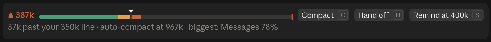

# context-guard

A Claude Code mod that warns you before your context gets too big, and gives you one-click ways out. It never acts on its own: it only warns and offers buttons.

## What you see

**Below the warning zone**, a meter in the status line:

```
ctx ▰▰▰▱▱▱▱▱ 142k
```

**Approaching your line** (50k before it), a one-row chip above the prompt:

```
◆ 318k  ━━━━━━━━━━━━━━━━━━━━━━━━━━━━━━━━━━━━━━━━━━━━━▼━━━━━━━━━▎  32k to your 350k line · ~4 turns
```

**Past your line**, a two-row band:

```
▲ 352k  ━━━━━━━━━━━━━━━━━━━━━━━━━━━━━━━━━━━━━━━━━━━━━━━━▼━━━━━▎  [Compact] [Hand off] [Remind at 400k]
2k past your 350k line · ~2 turns to auto-compact · auto-compact at 367k · biggest: Messages 66%
```

In the desktop app:




- **Gauge.** Green up to the chip zone, amber up to your line, coral past it. Your line is a caret with a notch through the bar, and auto-compact is the red cap at the end. In the desktop app it's an SVG that fills the row; in the terminal it's colored text.
- **Turns estimate.** Your average tokens per turn over the last five turns, turned into turns left. It only shows when it's 30 or fewer, since a far-off figure is noise.
- **Biggest.** The largest category from `/context`, so you can tell whether compacting will free much.
- **Crossing the line** also shows a 10-second toast inside Claude Code and posts a macOS notification banner, so you notice while Claude Code is in the background. Each fires once per crossing.

### Buttons

| Button | Hotkey | What it does |
|---|---|---|
| **Compact** | `c` | Compacts with an instruction to keep the goal, plan, decisions, open questions, file refs and next step. Pressed mid-turn, it queues ("Compact queued", with **Cancel**) and runs when the turn ends. |
| **Hand off** | `h` | Runs `/creating-handoffs`. While the skill writes, the band shows "Writing handoff: <path>"; once it's done, "✓ Handoff saved: <path>" with **Clear** (runs `/clear`) and **Dismiss**. |
| **Remind at N** | `s` | Raises your line by 50k for this session. Resets after a compact or `/clear`. |

Hotkeys work once the band has focus: ctrl+x then tab, or click it. In the desktop app, click the buttons.

### Sharing the space

Other plugins can draw above the prompt too, such as the next-steps suggestions box. context-guard draws its chip or band on top and keeps their content underneath, unchanged.

## The line

The warning line is the lower of **350k** and **auto-compact minus 50k**, so it always fires before Claude Code compacts on its own. The chip starts 50k before the line. The mod reads the real auto-compact point from each session.

| Session's auto-compact window | Auto-compact at | Chip from | Band from |
|---|---|---|---|
| 1M (desktop default) | ~967k | 300k | 350k |
| 400k | ~367k | ~267k | ~317k |
| 250k | ~217k | ~117k | ~167k |

To give desktop sessions the same window as a terminal alias, set `"autoCompactWindow": 400000` in `~/.claude/settings.json`. A `CLAUDE_CODE_AUTO_COMPACT_WINDOW` set by an alias still wins.

## Install

Point Claude Code at the folder in `~/.claude/settings.json` (works for terminal and desktop-app sessions):

```json
{ "env": { "CLAUDE_CODE_PLUGIN_DIRS": "~/path/to/claude-mod-garage/context-guard" } }
```

Or for one session: `claude --plugin-dir ~/path/to/claude-mod-garage/context-guard`.

The **Hand off** button expects a `creating-handoffs` skill; without one it shows a toast instead.

## Configure

Override any option in `~/.claude/settings.json`:

```json
{ "pluginConfigs": { "context-guard@inline": { "options": { "lineTokens": 300000 } } } }
```

| Option | Default | Meaning |
|---|---|---|
| `lineTokens` | 350000 | Cap for the warning line |
| `marginTokens` | 50000 | Gap below auto-compact, and the chip zone's length |
| `snoozeTokens` | 50000 | How far one Remind raises the line |
| `macNotification` | true | Also post a macOS notification banner when you cross the line |
| `compactInstructions` | keep goal, plan, … | What the Compact button asks the summary to keep |

`/context-guard-log` lists past crossings and clicks, useful for tuning the line.

## Develop

Folders in `CLAUDE_CODE_PLUGIN_DIRS` hot-reload on save in interactive sessions.

```bash
claude plugin validate .
claude plugin test .
```

The tests run on both the terminal and desktop surfaces. Requires a Claude Code build with function hooks (written against 2.1.286; the API is early access).
